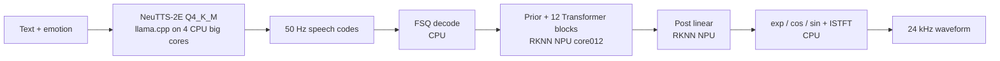

# NeuTTS-2E RK3588

Unofficial CPU + NPU deployment of [NeuTTS-2E](https://github.com/neuphonic/neutts) on Rockchip RK3588.

This project keeps the autoregressive NeuTTS-2E Q4_K_M backbone on four RK3588 big CPU cores and moves the NeuCodec decoder to the RKNN NPU. It also provides two evaluated reference-prefix strategies:

- `fixed207`: always use a 207-code speaker reference; the stable quality default.
- `routed103_207`: use 103 reference codes normally and 207 for `Angry`; the current low-RTF research candidate.

> This repository is an independent research adaptation, not an official Neuphonic release. Model weights and generated RKNN files are not redistributed here.

## Architecture



Core deployment changes:

- Speech-only output projection reduces the sampling candidates from 217,232 to 65,537.
- Compact logits avoid materializing the unused full-vocabulary output during speech generation.
- NeuCodec is split into RKNN-friendly stages; numerically fragile trigonometric operations and ISTFT remain on CPU.
- Dynamic decoder shapes use 256, 320, 384 and 450 frames.
- Emotion-aware reference routing reduces prompt-prefill cost without adding another neural model on-device.

## RK3588 results

OrangePi 5 Pro, RK3588, 16 GB RAM, Q4_K_M backbone, four big CPU cores fixed at 1.8 GHz, DMC/NPU performance mode, NPU `core012`.

RTF includes every request's prompt prefill, autoregressive generation, RKNN decoding and CPU ISTFT. Model/process initialization is excluded.

| Strategy | Mean RTF | P95 RTF | Complete | Emotional WER | DNSMOS SIG | Speaker similarity | Emotion target probability |
|---|---:|---:|---:|---:|---:|---:|---:|
| `fixed207` | 0.982 | 1.008 | 15/15 | 2.63% | 4.145 | 0.874 | 0.297 |
| `routed103_207` | **0.873** | **0.982** | **15/15** | 3.95% | **4.165** | 0.872 | **0.315** |

The routed strategy reduces mean RTF by **11.1%** on the current matrix. The route was selected from only three English texts and five conditions, so it must be validated on held-out texts, seeds and speakers before being treated as a general result.

For a resident low-idle-power profile, set `NEUTTS_POLL_BATCH=0`. It reduced observed idle server CPU from about one core to 0%, with steady backbone RTF changing from 0.837 to 0.851 (about 1.7% slower).

## Audio comparison

All pairs below use the same text, speaker, seed and generated speech-code sequence. The reference path is the original NeuCodec FP32 ONNX CPU decoder; the RK path uses the dynamic RKNN decoder plus CPU spectral tail.

Text: *“This is a real-time board deployment test. The voice should remain clear and expressive for a complete multi-second sentence.”*

| Emotion | CPU FP32 ONNX reference | RK3588 RKNN CPU+NPU |
|---|---|---|
| Happy | [listen](samples/cpu_onnx/happy.wav?raw=1) | [listen](samples/rk3588_rknn/happy.wav?raw=1) |
| Sad | [listen](samples/cpu_onnx/sad.wav?raw=1) | [listen](samples/rk3588_rknn/sad.wav?raw=1) |
| Angry | [listen](samples/cpu_onnx/angry.wav?raw=1) | [listen](samples/rk3588_rknn/angry.wav?raw=1) |

## Quick start

### 1. Prepare the board layout

```text
/home/orangepi/neutts_2e/
├── bin/llama-server
├── models/neutts-2e-Q4_K_M.gguf
├── models_dynamic/
│   ├── stage_prior_dynamic.rknn
│   ├── transformer_00_dynamic.rknn ... transformer_11_dynamic.rknn
│   └── post_linear_dynamic.rknn
└── scripts/
    ├── speakers.json
    └── files from this repository's scripts/
```

Download NeuTTS-2E Q4 weights from the [official model page](https://huggingface.co/neuphonic/neutts-2e-q4-gguf). Export `speakers.json` from the official NeuTTS assets:

```bash
python scripts/export_neutts_speakers.py \
  --samples /path/to/neutts/neutts/refs/neutts-2e \
  --output /home/orangepi/neutts_2e/scripts/speakers.json
```

The RKNN artifact conversion flow is documented in [docs/conversion.md](docs/conversion.md).

### 2. Build patched llama.cpp

The patch targets llama.cpp commit `7acdbb1f191d869bad8c5da9d4a2121defa340af`.

```bash
git clone https://github.com/ggml-org/llama.cpp.git
cd llama.cpp
git checkout 7acdbb1f191d869bad8c5da9d4a2121defa340af
git apply /path/to/NeuTTS-2E/patches/llama.cpp-neutts-speech-only.patch
cmake -B build -DGGML_NATIVE=ON -DGGML_OPENMP=ON -DLLAMA_CURL=OFF
cmake --build build --config Release -j4 --target llama-server
```

Copy `build/bin/llama-server` and its required shared libraries into the board `bin/` directory.

### 3. Start the resident backbone

```bash
NEUTTS_BOARD_ROOT=/home/orangepi/neutts_2e \
NEUTTS_COMPACT_LOGITS=1 \
bash scripts/run_neutts_2e_rk3588_server.sh
```

Use `NEUTTS_POLL_BATCH=0` when low idle CPU usage matters more than the last ~1.7% of decode throughput.

### 4. Synthesize

```bash
python scripts/synthesize_neutts_rk3588.py \
  --strategy fixed207 \
  --emotion sad \
  --text "The station was unusually quiet this evening." \
  --speakers /home/orangepi/neutts_2e/scripts/speakers.json \
  --model-dir /home/orangepi/neutts_2e/models_dynamic \
  --output outputs/fixed207_sad.wav

python scripts/synthesize_neutts_rk3588.py \
  --strategy routed103_207 \
  --emotion angry \
  --text "The station was unusually quiet this evening." \
  --speakers /home/orangepi/neutts_2e/scripts/speakers.json \
  --model-dir /home/orangepi/neutts_2e/models_dynamic \
  --output outputs/routed_angry.wav
```

The current prefix calibration is for the bundled `emily` reference. Other speakers require their own natural-boundary prefix calibration.

## Repository contents

- `scripts/synthesize_neutts_rk3588.py`: one-shot resident synthesis with both strategies.
- `scripts/neucodec_rk3588_split_runtime.py`: RKNN + CPU NeuCodec runtime.
- `scripts/benchmark_*`: resident backbone, codec and end-to-end benchmarks.
- `scripts/export_*`, `split_neucodec_onnx.py`, `convert_neucodec_rknn.py`: export/conversion flow.
- `patches/`: optional llama.cpp speech-only/compact-logits optimization.
- `results/`: compact benchmark summaries.
- `samples/`: same-token CPU-ONNX versus RKNN comparisons.

## License

NeuTTS-derived work is distributed under the [NeuTTS Open License v1.0](LICENSE). The llama.cpp patch targets MIT-licensed upstream code; its license is included in `third_party/LICENSE-llama.cpp`. See [NOTICE](NOTICE) for attribution and commercial-use limitations.
