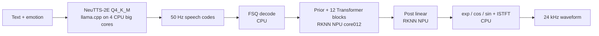

# NeuTTS-2E RK3588

Unofficial CPU + NPU deployment of [NeuTTS-2E](https://github.com/neuphonic/neutts) on Rockchip RK3588.

The Q4_K_M autoregressive backbone runs on four RK3588 big CPU cores. NeuCodec is split into RKNN-friendly stages for the NPU, while numerically sensitive spectral operations remain on the CPU. The measured resident pipeline reaches real time without changing or fine-tuning the original TTS model.

> This is an independent research adaptation, not an official Neuphonic release. Model weights, ONNX graphs and generated RKNN binaries are not redistributed.

## Release modes

Only the following modes are release paths:

| Mode | Reference policy | Status |
|---|---|---|
| `stable` | 207 codes for every emotion | Stable quality default |
| `fast` / `fast-v2` | 103 codes for all five calibrated emotions; automatic 207-code fallback otherwise | Board-evaluated low-RTF mode |

For the bundled Emily profile, `fast-v2` uses the 103-code prefix for Neutral, Happy, Sad and Surprised, and the independently re-encoded complete-context 103-code reference for Angry. Other supported but uncalibrated emotions still fall back to `stable`; `all-103` therefore means all five board-calibrated conditions, not every emotion or speaker.

The legacy names `fixed207` and `routed103_207` remain accepted as aliases for `stable` and `fast`; `fast-v2` selects the current `fast` policy. Research-only short-reference controls are documented in [the complete-context reference study](docs/reference-selection.md).

## RK3588 results

Measured on an OrangePi 5 Pro with RK3588 and 16 GB RAM. The Q4_K_M backbone used four big CPU cores fixed at 1.8 GHz. NeuCodec used dynamic RKNN graphs on NPU `core012`, followed by the CPU spectral tail.

RTF includes prompt prefill, autoregressive generation, RKNN decoding and CPU ISTFT for every request. Process and model initialization are excluded.

| Mode | Mean RTF | P95 RTF | Complete | Emotional WER | DNSMOS SIG | Speaker similarity | Emotion target probability |
|---|---:|---:|---:|---:|---:|---:|---:|
| `stable` | 0.982 | 1.008 | 15/15 | 2.63% | 4.145 | 0.874 | 0.297 |
| `fast-v1` (archived) | **0.873** | **0.982** | **15/15** | 3.95% | **4.165** | 0.872 | **0.315** |

The archived `fast-v1` policy used 103 codes for four conditions and 207 for Angry; it reduced mean RTF by **11.1%** on this matrix. The matrix contains three English texts and five emotion conditions, so these numbers should not be interpreted as a multi-speaker or large-corpus result. Raw summaries are in [results/benchmark_summary.json](results/benchmark_summary.json) and [results/routed_ref103_angry_ref207.json](results/routed_ref103_angry_ref207.json).

The subsequent Angry release gate compared re-encoded natural-103 with 207 over three texts and three seeds. Natural-103 completed 9/9 generations, kept the WER increase within 2 percentage points, and improved DNSMOS SIG and Angry target probability. Under the optimized fixed-1.8-GHz resident service, its mean/P95 RTF was **0.858/0.874**, versus **1.006/1.024** for 207. See [results/natural103_angry_rk3588.json](results/natural103_angry_rk3588.json).

For a resident low-idle-power profile, set `NEUTTS_POLL_BATCH=0`. It reduced observed idle server CPU from about one core to 0%, while steady backbone RTF changed from 0.837 to 0.851 (about 1.7% slower).

## Architecture



Deployment changes:

- Speech-only output projection reduces sampling candidates from 217,232 to 65,537.
- Compact logits avoid materializing the unused full-vocabulary output during speech generation.
- NeuCodec prior, twelve Transformer blocks and post-linear head run as separate RKNN stages.
- Exp, Cos, Sin and ISTFT stay on CPU because they were numerically fragile with the tested RKNN 2.3.x toolchain.
- Dynamic decoder shapes support 256, 320, 384 and 450 frames.
- Per-speaker reference profiles shorten prompt prefill without adding an on-device neural model.

## Quick start

### Requirements

Board:

- ARM64 Linux on RK3588; OrangePi 5 Pro 16 GB is the tested device
- Rockchip NPU driver and RKNN Toolkit Lite2 runtime compatible with the generated models
- Python 3.9 or newer and NumPy
- Patched `llama-server` and its shared libraries

Conversion host:

- Official NeuTTS/NeuCodec implementation and downloaded checkpoints
- PyTorch, ONNX and ONNX Runtime
- RKNN Toolkit2 compatible with the board runtime

### 1. Prepare the board

```text
/home/orangepi/neutts_2e/
├── bin/llama-server
├── configs/
│   ├── reference_strategies.json
│   └── emily_natural103_reencoded.json
├── models/neutts-2e-Q4_K_M.gguf
├── models_dynamic/
│   ├── stage_prior_dynamic.rknn
│   ├── transformer_00_dynamic.rknn ... transformer_11_dynamic.rknn
│   └── post_linear_dynamic.rknn
└── scripts/
    ├── speakers.json
    └── Python and shell files from this repository's scripts/
```

Download the Q4 weights from the [official model page](https://huggingface.co/neuphonic/neutts-2e-q4-gguf). Export the official fixed-speaker references to a torch-free JSON asset:

```bash
python3 scripts/export_neutts_speakers.py \
  --samples /path/to/neutts/neutts/refs/neutts-2e \
  --output /home/orangepi/neutts_2e/scripts/speakers.json
```

Generate the RKNN artifacts by following [docs/conversion.md](docs/conversion.md), then copy `scripts/`, `configs/` and the generated model directory to the board.

### 2. Build patched llama.cpp

The patch targets llama.cpp commit `7acdbb1f191d869bad8c5da9d4a2121defa340af`.

```bash
git clone https://github.com/ggml-org/llama.cpp.git
cd llama.cpp
git checkout 7acdbb1f191d869bad8c5da9d4a2121defa340af
git apply /path/to/NeuTTS-2E-rk3588/patches/llama.cpp-neutts-speech-only.patch
cmake -B build -DGGML_NATIVE=ON -DGGML_OPENMP=ON -DLLAMA_CURL=OFF
cmake --build build --config Release -j4 --target llama-server
```

Copy `build/bin/llama-server` and its required shared libraries into the board `bin/` directory.

### 3. Start the resident backbone

```bash
NEUTTS_BOARD_ROOT=/home/orangepi/neutts_2e \
NEUTTS_COMPACT_LOGITS=1 \
bash scripts/run_neutts_2e_rk3588_server.sh
```

Use `NEUTTS_POLL_BATCH=0` when low idle CPU usage matters more than the last approximately 1.7% of backbone throughput.

### 4. Synthesize

Stable mode:

```bash
python3 scripts/synthesize_neutts_rk3588.py \
  --strategy stable \
  --emotion sad \
  --text "The station was unusually quiet this evening." \
  --speakers /home/orangepi/neutts_2e/scripts/speakers.json \
  --model-dir /home/orangepi/neutts_2e/models_dynamic \
  --output outputs/stable_sad.wav
```

Fast mode with validation-aware fallback:

```bash
python3 scripts/synthesize_neutts_rk3588.py \
  --strategy fast-v2 \
  --emotion angry \
  --text "The station was unusually quiet this evening." \
  --speakers /home/orangepi/neutts_2e/scripts/speakers.json \
  --model-dir /home/orangepi/neutts_2e/models_dynamic \
  --output outputs/fast_v2_angry.wav
```

The output JSON sidecar records the selected reference, its validation status and whether a fallback occurred.

## Audio comparison

Each pair uses the same text, speaker, seed and generated speech-code sequence. The CPU reference uses the FP32 ONNX NeuCodec decoder; the RK path uses the dynamic RKNN decoder and CPU spectral tail.

Text: *“This is a real-time board deployment test. The voice should remain clear and expressive for a complete multi-second sentence.”*

| Emotion | CPU FP32 ONNX | RK3588 CPU + NPU |
|---|---|---|
| Happy | [listen](samples/cpu_onnx/happy.wav?raw=1) | [listen](samples/rk3588_rknn/happy.wav?raw=1) |
| Sad | [listen](samples/cpu_onnx/sad.wav?raw=1) | [listen](samples/rk3588_rknn/sad.wav?raw=1) |
| Angry | [listen](samples/cpu_onnx/angry.wav?raw=1) | [listen](samples/rk3588_rknn/angry.wav?raw=1) |

Short-reference controls can be heard in [the reference-selection study](docs/reference-selection.md#same-text-audio-control).

## Reference profiles

[configs/reference_strategies.json](configs/reference_strategies.json) separates release policy from speaker assets. A release mode may use a short reference only for emotions listed in `validated_emotions`; otherwise it fails closed to its configured stable reference. Standalone `code_file` references allow independently encoded audio crops instead of slicing a longer code stream.

The bundled calibration is specific to Emily. Other speakers need an exact transcript, independently encoded candidate references and their own evaluation. The offline [reference-budget search tool](scripts/search_reference_budget.py) enumerates low-energy 80–103-code windows, checks complete linguistic context with Whisper, and independently encodes accepted crops. The selection protocol, command and configuration contract are documented in [docs/reference-selection.md](docs/reference-selection.md).

## Repository layout

- `scripts/synthesize_neutts_rk3588.py`: resident end-to-end synthesis using release or research reference modes.
- `scripts/neucodec_rk3588_split_runtime.py`: RKNN + CPU NeuCodec runtime.
- `scripts/benchmark_*`: backbone, codec and end-to-end measurement tools.
- `scripts/export_*`, `split_neucodec_onnx.py`, `convert_neucodec_rknn.py`: host export and conversion flow.
- `configs/`: versioned per-speaker reference policy and standalone research codes.
- `patches/`: llama.cpp speech-only and compact-logits optimization.
- `results/`: compact benchmark and study summaries.
- `samples/`: same-token decoder comparisons and short-reference controls.
- `tests/`: reference-window and release-fallback tests.

## Limitations

- Board results cover one speaker, three texts and five emotion conditions.
- The dynamic decoder currently supports at most 450 generated codes, approximately nine seconds at 50 Hz; longer generation is rejected.
- Reference quality is speaker-specific. A token count alone is not a safe selection rule.
- The complete-context 103-code result is board-validated only for Emily Angry; it is not a speaker-independent reference rule.
- Weights and generated model artifacts remain subject to their upstream licenses and are not included.

## License

NeuTTS-derived work is distributed under the [NeuTTS Open License v1.0](LICENSE). The llama.cpp patch targets MIT-licensed upstream code; its license is included in [third_party/LICENSE-llama.cpp](third_party/LICENSE-llama.cpp). See [NOTICE](NOTICE) for attribution and commercial-use limitations.
